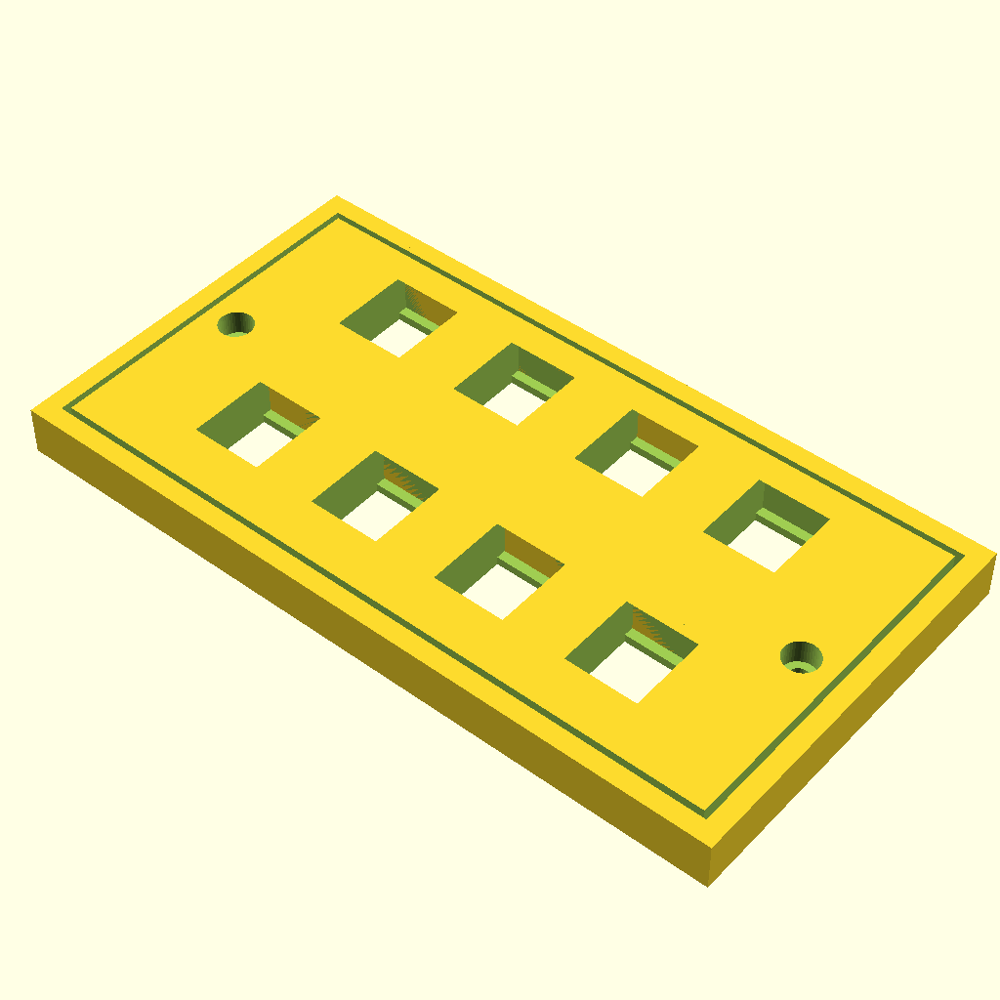
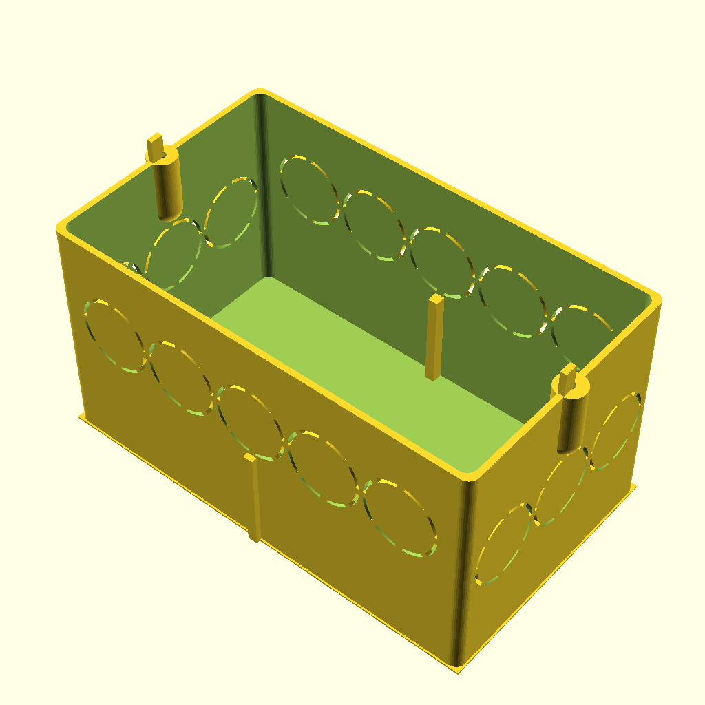
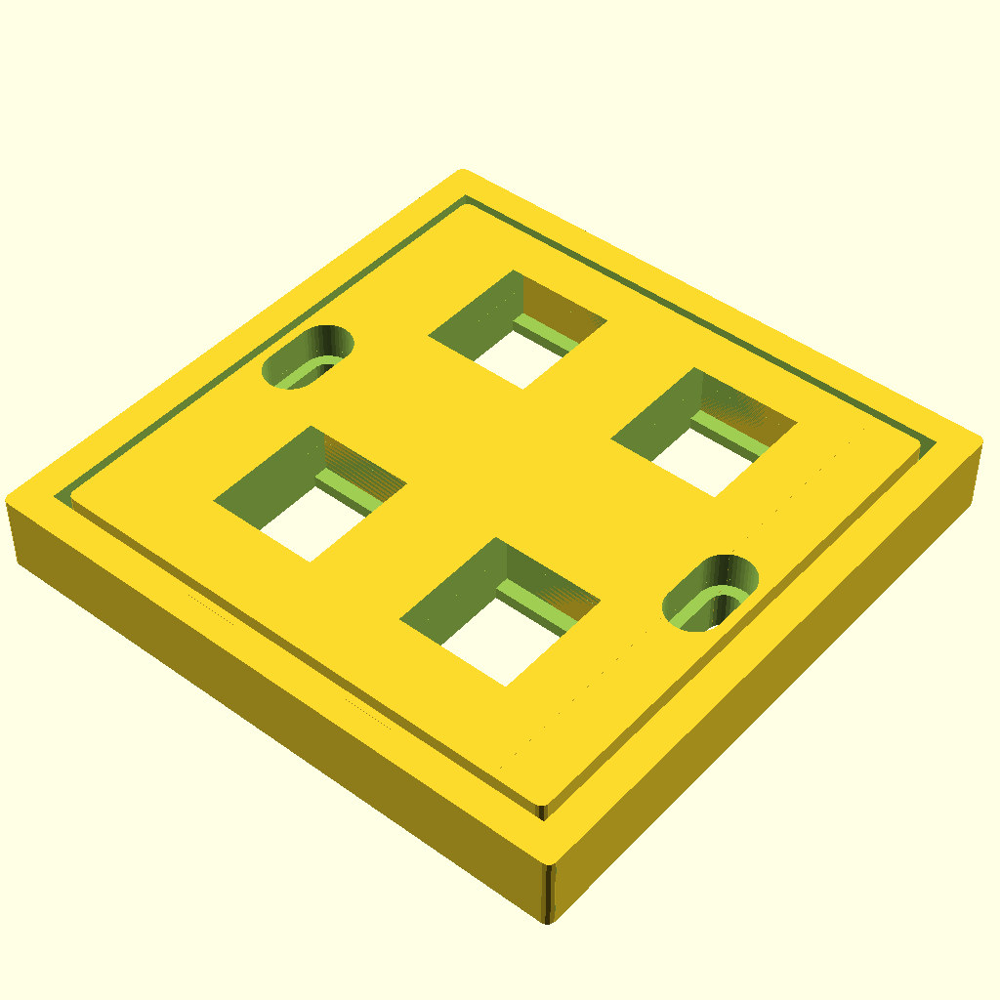
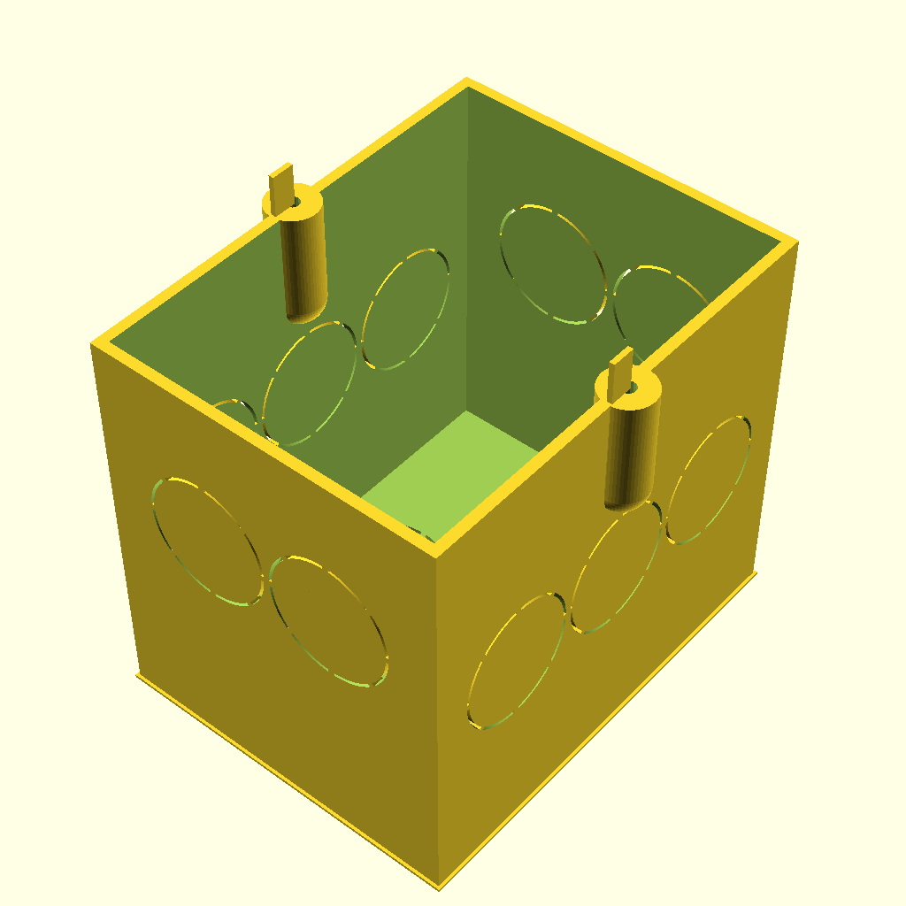
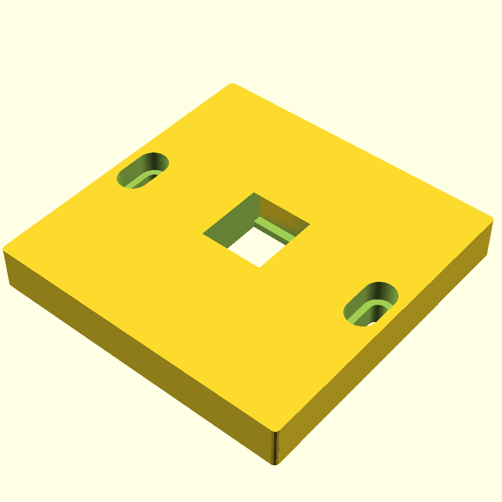
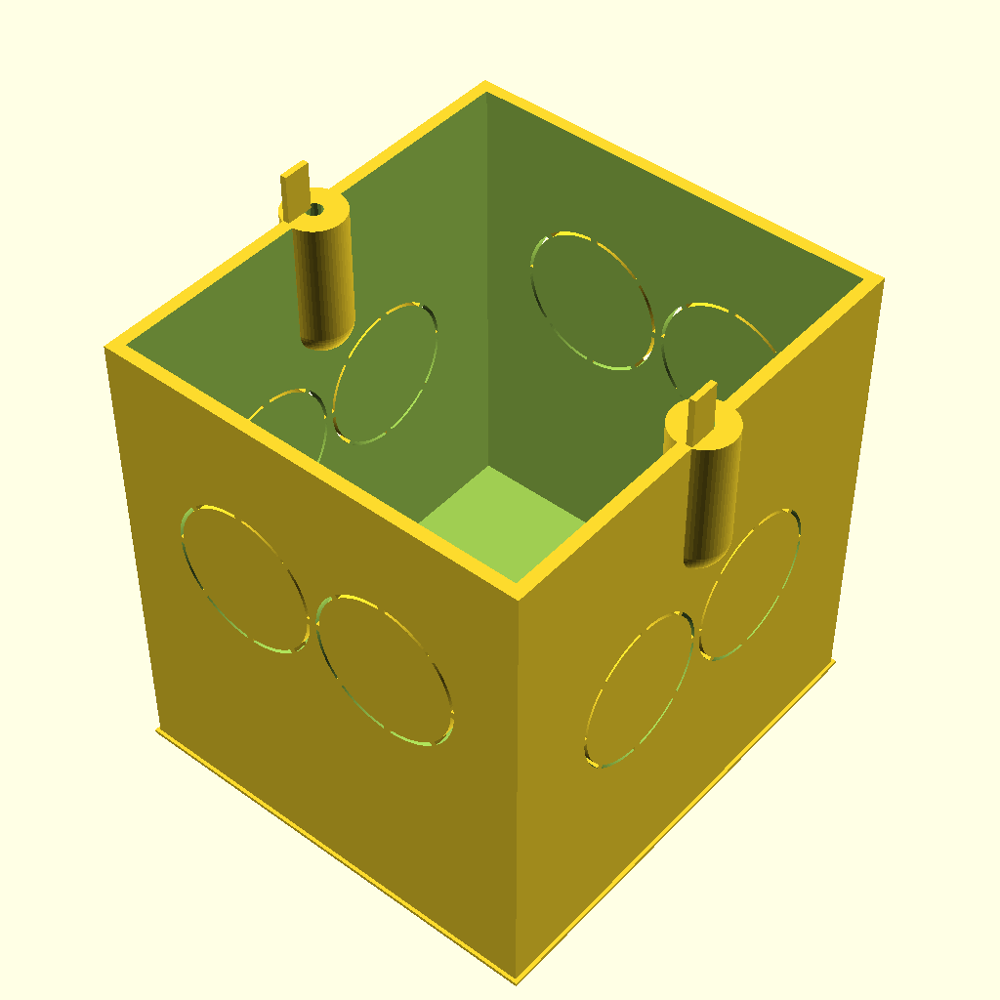

# PanelGenerator
Create panels for keystone with openscad. The panels do fit (somewhat) to the Jung LS990 series.

Work in progress, do not use it yet, but feel free to review and comment.

I used an existing generator (https://www.thingiverse.com/thing:1741072) as a starting point. Many mods where required.

The required in-wall mounting box will also be included.

Find the .stl files in the STL folder.

| Panel for 8 keystones with Jung LS990 frame emulation | In wall box | A real photo | |
| :----: | :----: | :----: | :----: |
| |  | TBD | Has the same sizes as a double LS990 frame. |

| Panel for 4 keystones with Jung LS990 frame emulation | In wall box | A real photo | |
| :----: | :----: | :----: | :----: |
| |  | TBD | Screw distance is 60mm, but off the shelf boxes are probably too small.|

| Panel for 1 keystone fits to a real Jung LS990 frame | In wall box | A real photo | |
| :----: | :----: | :----: | :----: |
| |  | TBD | Screw distance is 60mm so it should also fit into regular boxes (64mm dept). Fits into a regular Jung LS990 single frame. |

