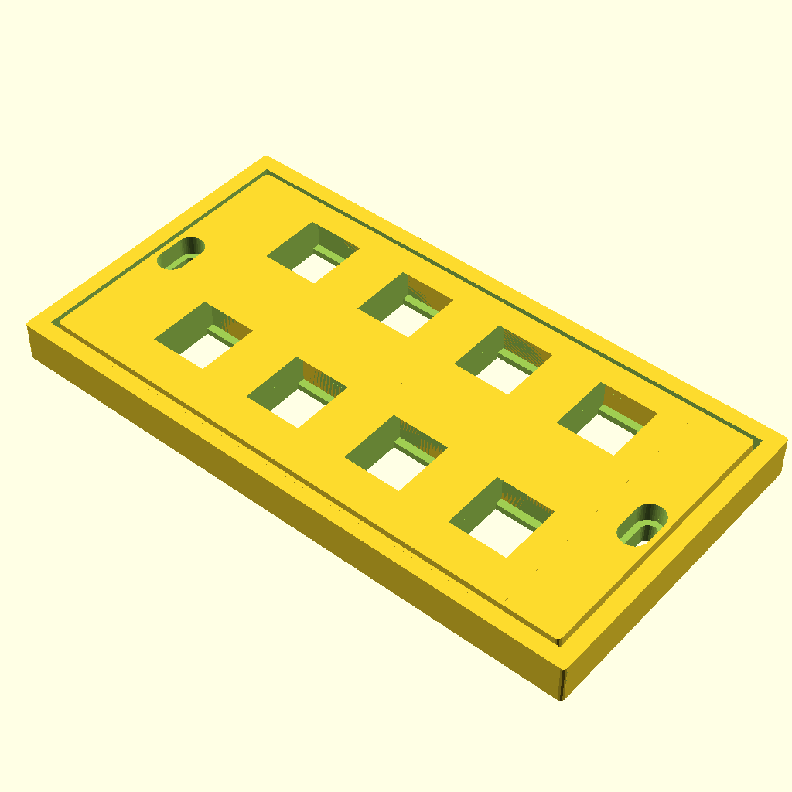
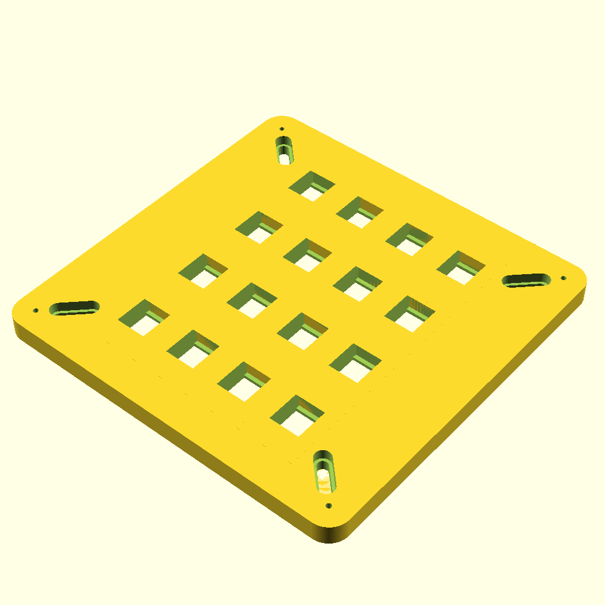
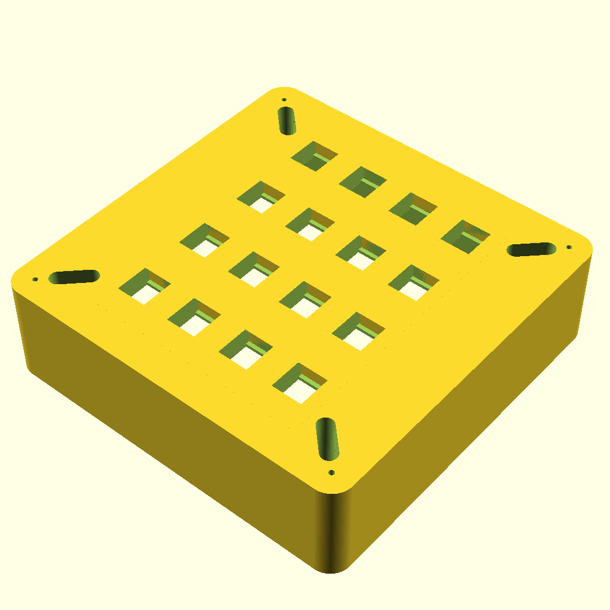

# PanelGenerator
Create panels for keystone with openscad. The panels do fit (somewhat) to the Jung LS990 series.

Work in progress, do not use it yet, but feel free to review and comment.

I used an existing generator (https://www.thingiverse.com/thing:1741072) as a starting point. Many mods where required.

The required in-wall mounting box will also be included.

Find the .stl files in the STL folder.

| Panel for 8 keystones with Jung LS990 frame emulation | In wall box | A real photo | Description |
| :----: | :----: | :----: | :----: |
| |  |  | Has the same sizes as a double LS990 frame. |

| Panel for 4 keystones with Jung LS990 frame emulation | In wall box | A real photo | Description |
| :----: | :----: | :----: | :----: |
| |  | TBD | Screw distance is 60mm, but "off the shelf" boxes are probably too small.|

| Panel for 1 keystone fits to a real Jung LS990 frame | In wall box | A real photo | Description |
| :----: | :----: | :----: | :----: |
| |  | TBD | Fits into a regular Jung LS990 frame. Screw distance is 60mm so it should also fit into regular boxes (64mm dept). E.g. Kaiser 1555-04. Or use the box for the 1_4 flavour.  |

| Panel for 1 keystone fits to a real Jung LS990 frame | In wall box | A real photo | Description |
| :----: | :----: | :----: | :----: |
| |  | TBD | You need to glue it to the frame somehow. Fits into a regular Jung LS990 frame. Screw distance is 60mm so it should also fit into regular boxes (64mm dept). E.g. Kaiser 1555-04. Or use the box for the 1_4 flavour.  |

| Panel for 12 keystones for a std. in wall box (Junction casing) with 159mm size | In wall box | A real photo | Description |
| :----: | :----: | :----: | :----: |
| |  | TBD | For Kaiser 1096-91, EAN 4013456152007. The holes for the cover mounting are prepared for M3 heat inserts.  |

| Panel for 12 keystones for a std. in wall box (Junction casing) with 159mm size | In wall box | A real photo | Description |
| :----: | :----: | :----: | :----: |
| |  | TBD | For Kaiser 1096-91, EAN 4013456152007. This also offers some extra space for cables.  The holes for the cover mounting are prepared for M3 heat inserts. |

| Cover for 12 keystones for a std. in wall box (Junction casing) with 159mm size | Cover | A real photo | Description |
| :----: | :----: | :----: | :----: |
| | | TBD | This is a cover to protect the short patch cables. |

