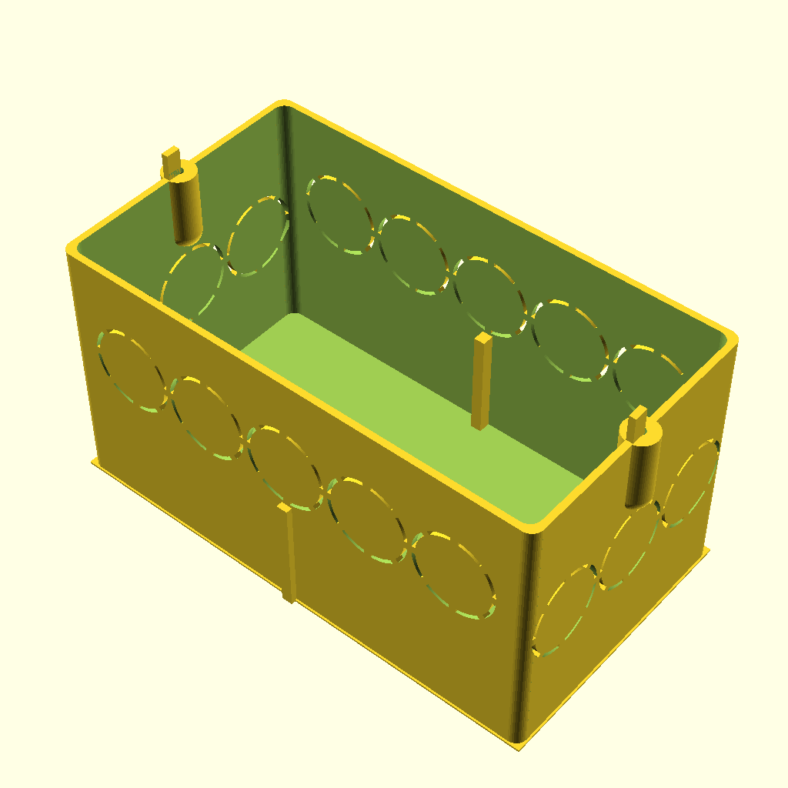
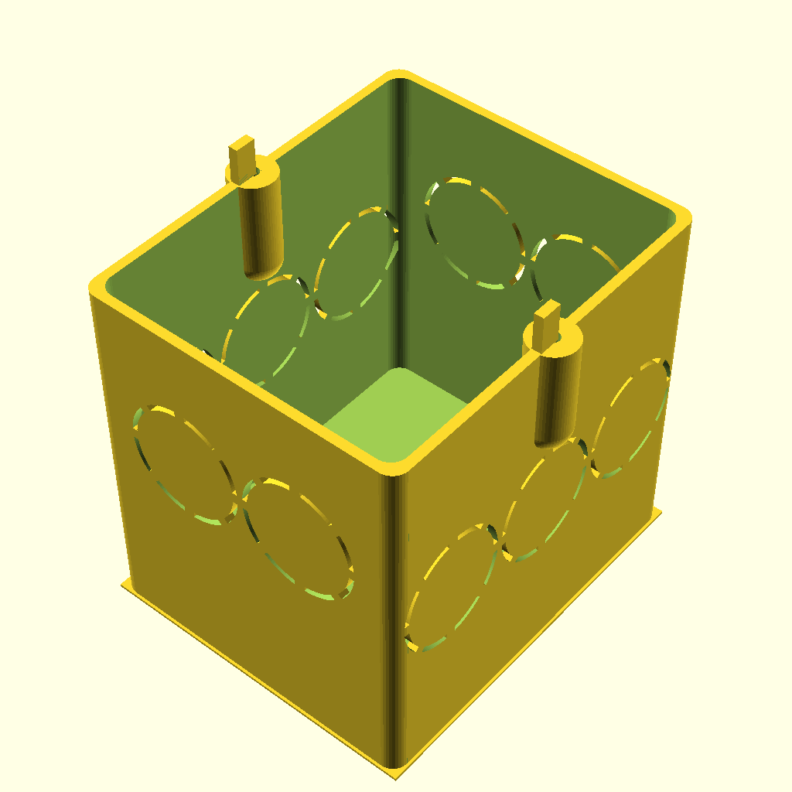

# PanelGenerator
Create panels for keystone with openscad

Work in progress, do not use it yet.

Plan is to reuse an existing generator and create panels that fit inside a frame from Jung (LS990 series).

The required in-wall mounting box will also be included.

Find the .stl files in the STL folder.

| Panel for 8 keystones with Jung LS990 frame emulation | In wall box | A real photo |
| :----: | :----: | :----: |
| |  | TBD |

| Panel for 4 keystones with Jung LS990 frame emulation | In wall box | A real photo |
| :----: | :----: | :----: |
| |  | TBD |

| Panel for 1 keystone for a real Jung LS990 frame | In wall box | A real photo |
| :----: | :----: | :----: |
| | ) | TBD |

